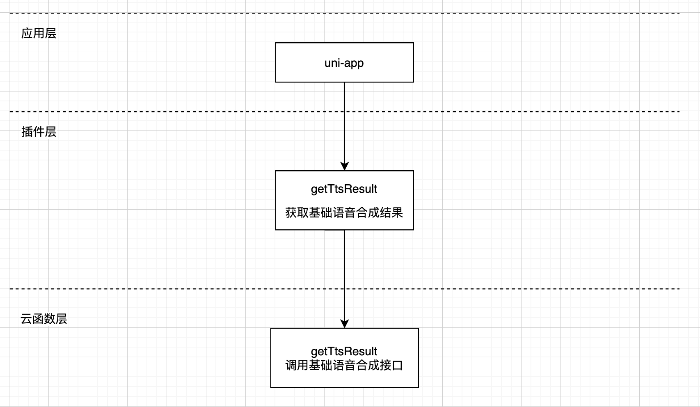

# 腾讯云语音合成（TTS）插件

## 1. 插件介绍
| 标题      | 名称    |
| ----     | ---------------- |
| 中文名称   | 腾讯云语音合成（TTS）插件 |
| 英文名称   | tencentcloud-plugin-tts |
| 最新版本   | v1.0.0 (2020.11.26) |
| 适用平台   | [DCloud uni-app](https://uniapp.dcloud.net.cn) |
| 适用产品   | [腾讯云语音合成（TTS）](https://cloud.tencent.com/product/tts) |
| GitHub项目| [tencentcloud-uniapp-plugin-tts](https://github.com/Tencent-Cloud-Plugins/tencentcloud-uniapp-plugin-tts) |
| gitee项目| [tencentcloud-uniapp-plugin-tts](https://gitee.com/Tencent-Cloud-Plugins/tencentcloud-uniapp-plugin-tts) |
| Demo项目   | [tencentcloud-uniapp-plugin-example](https://github.com/Tencent-Cloud-Plugins/tencentcloud-uniapp-plugin-example) |
| 主创团队   | 腾讯云中小企业产品中心（SMB Product Center of Tencent Cloud） |
| 兼容平台   | H5、小程序、APP |

一款帮助开发者在uni-app项目开发中快捷使用腾讯云语音合成（TTS）产品功能的插件。

## 2. 功能特性

- 基础语音合成功能

## 3. 安装指引

本插件需要调用uniCloud云函数，而使用云函数的前提是：

- 使用DCloud官方开发工具HBuilderX 2.7+；
- 已注册DCloud开发者账号并通过实名认证；
- 开通了uniCloud并创建一个腾讯云的服务空间；

### 3.1. 新建或打开已有项目

1. 打开HBuilderX开发工具；
1. 新建或打开一个uni-app项目；

### 3.2. 导入云函数

1. 访问 DCloud 插件市场的 [腾讯云插件 - 云函数模板](https://ext.dcloud.net.cn/plugin?id=2139) 详情页；
2. 点击详情页右上角 **使用 HBuilderX 导入插件**，将云函数模板导入到您的项目中；

3. 在项目中打开 _cloudfunctions/tencentcloud-plugin/config.js_ 文件，将腾讯云的密钥信息配置进去，可以在腾讯云 [API 密钥管理](https://console.cloud.tencent.com/cam/capi) 中获取 SecretId、SecretKey 和 APPID；

4. 在[uniCloud控制台](https://unicloud.dcloud.net.cn/login)注册HBuild账号并登录，创建[云服务空间](https://uniapp.dcloud.net.cn/uniCloud/concepts/space)；
5. 在项目中打开 _cloudfunctions/tencentcloud-plugin/tts/config.js 文件，将region配置进去，具体可参考[地域列表](https://cloud.tencent.com/document/api/1073/37989#.E5.9C.B0.E5.9F.9F.E5.88.97.E8.A1.A8)；

6. 绑定云函数的云服务空间，将[云函数](https://uniapp.dcloud.net.cn/uniCloud/concepts/cloudfunction) [**上传部署**](https://uniapp.dcloud.net.cn/uniCloud/quickstart?id=rundebug) 到您的[云服务空间](https://uniapp.dcloud.net.cn/uniCloud/concepts/space)；


> 如果您之前在使用其它腾讯云产品的 uni-app 插件时已经导入过此云函数模板，则前 4 个步骤可以省略。

> 若导入失败或有其它疑问，请查看 [uniCloud帮助文档](https://uniapp.dcloud.io/uniCloud/README) 云函数相关章节。

### 3.3. 导入插件

1. 访问DCloud插件市场 [腾讯云语音合成（TTS）插件](https://ext.dcloud.net.cn/plugin?id=3517) 详情页；
2. 点击详情页右上角 **使用HBuilderX导入插件** ，将插件导入到您的项目中；
3. 在项目中通过 import 语法将插件提供的方法导入到相关业务组件并使用；

> 本插件的默认导入位置是在您项目的“js_sdk”目录下

## 4. 使用指引

### 4.1. 插件API导图



### 4.2. 插件API列表

| API名称          | API对应方法名 |
| ---------------- | ------------- |
| 获取基础语音合成结果 | getTtsResult |

### 4.3. 插件使用示例

```javascript
// 基础语音合成使用示例
// 从js_sdk列表中导入需要的api
import { getTtsResult, randStr } from "@/js_sdk/tencentcloud-plugin-tts";

export default {
  data() {
    return {
    };
  },
  methods: {
    // 开始语音合成
    async startCompound() {
      const paramsData = {
        Text: '你好，我来自中国!',
        SessionId: randStr(6)
      };
      const result  = await getTtsResult(paramsData);
    }
  }
};
```

### 4.4 主要API 说明

#### getTtsResult(params) ⇒ <code>Promise.&lt;object&gt;</code>
**Returns**: <code>Promise.&lt;object&gt;</code> - result 基础语音合成结果

| Param          | Type | Required |  Description |
| ---------------- | ------------- | ---- | ---- |
| params | <code>object</code> | <code>true</code> | 基础语音合成配置参数 |
| params.Text | <code>string</code> | <code>true</code> | 合成语音的源文本 |
| params.SessionId | <code>string</code> | <code>true</code> | 一次请求对应一个SessionId，建议传入类似于uuid的字符串防止重复 |
| params.ModelType | <code>Integer</code> | <code>false</code> | 模型类型，1-默认模型 |
| params.Volume | <code>Float</code> |  <code>false</code> | 音量大小，范围：[0，10]，分别对应11个等级的音量，默认为0，代表正常音量 |
| params.Speed | <code>Float</code> |  <code>false</code> | 语速，范围：[-2，2]，分别对应不同语速 |
| params.ProjectId | <code>Integer</code> |  <code>false</code> | 项目id，用户自定义，默认为0 |
| params.VoiceType | <code>Integer</code> |  <code>false</code> | 音色 |
| params.PrimaryLanguage | <code>Integer</code> |  <code>false</code> | 主语言类型 1：中文（默认） 2：英文 |
| params.SampleRate | <code>Integer</code> |  <code>false</code> | 音频采样率：16000：16k（默认）8000：8k |
| params.Codec | <code>string</code> |  <code>false</code> | 返回音频格式，可取值：wav（默认），mp3 |

### 4.5. 名词解释

服务空间：一个服务空间对应一整套独立的云开发资源，包括数据库、存储空间、云函数等资源。服务空间之间彼此隔离。更多详情请访问 [uniCloud开发文档](https://uniapp.dcloud.io/uniCloud/concepts/space)

云函数：云函数是运行在云端的JavaScript代码，更多详情请见 [uniCloud云函数文档](https://uniapp.dcloud.io/uniCloud/cf-functions)

## 5. 获取入口

| 插件入口       | 链接                                                                      |
| -------------- | ------------------------------------------------------------------------- |
| DCloud插件市场 | [腾讯云语音合成（TTS）插件](https://ext.dcloud.net.cn/plugin?id=3517) |

## 6. FAQ
> 暂无


## 7. GitHub版本迭代记录

### 7.1. tencentcloud-uniapp-plugin-tts v1.0.0

- 基础语音合成功能
  
## 8. 联系我们

&nbsp;&nbsp;&nbsp;扫码备注“云插件”来联络到我们</br>

